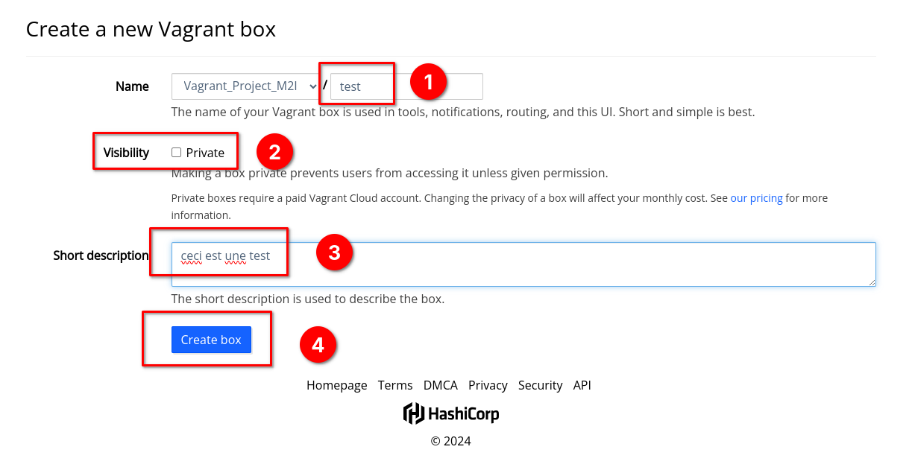
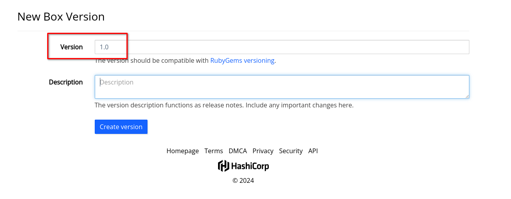
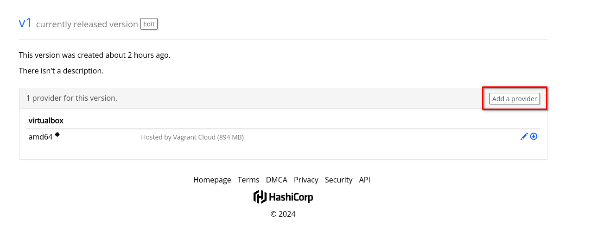

Vagrant_Project

Pour créé un environement Vagrant il faut taper les commandes suivantes :

```bash
$ vagrant init <nom_du_vagrant_à_récupérer>
```

Le vagrant init va créé notre vagrant file qui contient toute notre configuration

```bash
$ vagrant up
```

Le vagrant up va lancer notre script vagrant et l'intégrer sur notre hyperviseur.

## Utilisation de Vagrant Cloud

### Ajouter une nouvelle box

1. Se rendre sur https://app.vagrantup.com/ et se connecter avec son compte.
2. Une fois arrivé sur le site, nous pouvons voir notre tableau de bord avec tous nos providers :


1. Pour rajouter une image, cliquez sur `New Vagrant Box`
2. Ensuite donner un nom à notre box(1), sélectionnez sa visibilité public(2), une courte description de la box(3) puis cliquez sur `Create Box`(4) :



1. Mettre un numéro de version par défaut mettre `1.0` :



1. Notre box est prête.

### Créer sa box

1. Tout d'abord créé et installer une machine virtuelle avec tous les outils que l'on souhaite. Une fois la machine terminé l'éteindre et se rendre sur le terminal.
2. Dans le terminal se rendre dans le repertoire où sont stockée nos machines virtuelles et taper la commande suivante :

```shell
$ vagrant package --output <nomdenotrebox.box> --base "<nomdufichier>"
```

Une fois la commande passé vagrant va extraire notre machine virtuelle et la compressé dans un fichier.

La box est alors créé.

#### Exception sur les machines Linux

Sur les machines Linux il nous faut ajouter la clé ssh officiel de Vagrant. Cette clé permettras de prendre la main en ssh à nos machines via la commande `vagrant ssh`.

```shell
$ sudo apt-get install linux-headers-$(uname -r) build-essential dkms
$ sudo mount /dev/cdrom /media/cdrom
$ sudo sh /media/cdrom/VBoxLinuxAdditions.run
$ useradd -m -s /bin/bash vagrant
$ passwd vagrant
# Mettre vagrant en mot de passe
$ mkdir /home/vagrant/.ssh
$ wget -O /home/vagrant/.ssh/authorized_keys  https://github.com/hashicorp/vagrant/raw/master/keys/vagrant.pub
$ chown -R vagrant:vagrant /home/vagrant/.ssh
$ chmod 700 /home/vagrant/.ssh
$ chmod 600 /home/vagrant/.ssh/authorized_keys 
```

### Ajouter un provider

1. Cliquez sur `Add a provider` :



1. Ensuite sélectionner le provider, ce seras toujours par défaut `Virtualbox`(1), choisir l'architecture de la box par défaut `AMD64`(2) puis récupérer notre box en local.
2. La box est bien importé dans le cloud