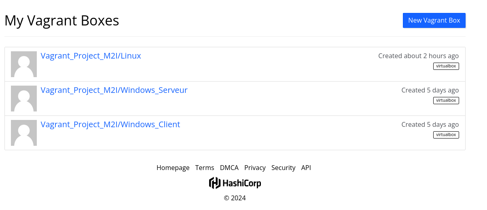

Vagrant_Project

Pour créé un environement Vagrant il faut taper les commandes suivantes : 

```bash
$ vagrant init <nom_du_vagrant_à_récupérer>
```
Le vagrant init va créé notre vagrant file qui contient toute notre configuration

```bash
$ vagrant up
```

Le vagrant up va lancer notre script vagrant et l'intégrer sur notre hyperviseur.

## Utilisation de Vagrant Cloud 

### Ajouter une nouvelle box

1. Se rendre sur https://app.vagrantup.com/ et se connecter avec son compte.
2. Une fois arrivé sur le site, nous pouvons voir notre tableau de bord avec tous nos providers : 



3. Pour rajouter une image, cliquez sur `New Vagrant Box`
4. Ensuite donner un nom à notre box(1), sélectionnez sa visibilité public(2), une courte description de la box(3) puis cliquez sur `Create Box`(4) :


5. Mettre un numéro de version par défaut mettre `1.0` : 


6. Notre box est prête. 

### Récupérer une box 

